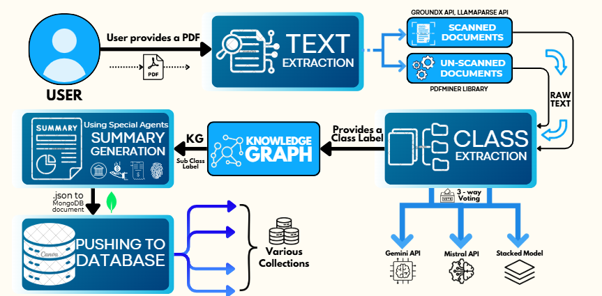

# FinDoc.ai: Streamlined Financial Document Classification and Processing

## Overview  
**FinDoc.ai** is an intelligent system designed to automate the classification and summarization of unstructured financial documents for Appian Credit Union. It leverages machine learning, large language models, and knowledge graphs to enhance efficiency, reduce manual effort, and improve the reliability of document organization.

## FinDoc.ai Pipeline




### Problem Statement  
Appian Credit Union receives thousands of documents daily, such as:  
- **Applications for bank accounts** (credit card, savings account).  
- **Identity documents** (driver’s license, passport).  
- **Supporting financial documents** (income statements, tax returns).  
- **Receipts.**  

These documents have traditionally been manually verified, a process that is repetitive and time-consuming. **FinDoc.ai** provides a technological solution to:  
1. Categorize documents hierarchically:  
   - Associate documents with the correct individual using attributes like name, government ID, or email.  
   - Identify document types and group them accordingly.  
2. Summarize documents to expedite downstream processes.  

---

## Folder Structure  

### 1. **`Data/`**  
Contains preprocessed datasets used for model training:  
- Financial data (HuggingFace).  
- Receipt data (HuggingFace).  
- Identity data (Github).  
- Bank data (synthetically generated using Faker).  

_Data preparation scripts are in the `feat/Synthetic-data-gen` branch._  

---

### 2. **Text Extraction Services**  
Handles PDF-to-text conversion using the following parsers:  
- **GroundX** (`parser_groundx.py`).  
- **LlamaParse** (`parser_llama.py`).  
- **PDFMiner** (`parser_pdfminer.py`).  
- **Scan Checker** (`scan_checker.py`): Determines if a PDF is scanned.  

#### **Text Extraction Pipeline**  
- **Machine-Readable Documents:**  
  - Verified readability using PyPDF2.  
  - Extracted text using PDFMiner without OCR.  
- **Scanned Documents:**  
  - Utilized OCRMYPDF for OCR-based text extraction.  
  - Implemented advanced parsing methods:  
    - X-Ray Parser (EyeLevel.AI + GroundX API for JSON output).  
    - LlamaParse (LLamaIndex + OCR).  
- **Handling Large Documents:**  
  - Split documents into fixed-size chunks for efficient processing.  

---

### 3. **Classification Models and Agents**  

#### **Stacking Models:**  
- **Models Used:**  
  - XGBoost, LightGBM, CatBoost as base classifiers.  
  - XGBoost as the meta-classifier.  
- **Process:**  
  - Encoded text using SentenceTransformer (`Nvidia-Embed-v2`).  
  - Base classifiers provide predictions.  
  - Meta-classifier combines predictions for final output

#### **Gemini and Mistral Agents:**  
- **Gemini Agent:**  
  - Langchain ChatGoogleGenerativeAI (Gemini-1.5-Flash).  
  - Uses few-shot examples and structured prompts.  
- **Mistral Agent:**  
  - Langchain ChatGroq (Mixtral-8x7b-32768).  
  - Employs Chain-of-Thought reasoning and structured prompts.  

#### **Majority Voting:**  
Combines predictions from base models and agents for consensus-based classification, improving accuracy.  

**Scripts:**  
- `base_ml_model.py`  
- `gemini_base_agent.py`  
- `mistral_base_agent.py`  

_Trained models are stored in `Trained_Base_Models/` (joblib format)._  

---

### 4. **Knowledge Graph Construction**  
- **Script:** `KGAgent/KnowledgeGraphAgent.py`  
- Converts unstructured data into a structured knowledge graph (KG) for enhanced understanding.  
- Supports multiple document types (Bank, Finance, Receipt, Identity).  

#### **Specialist Agents (Llama-3-70b):**  
- **Bank Specialist:** Analyzes banking documents and provides summary of the document along with the finer classifications like it is a credit card application or a savings account application.  
- **Financial Specialist:** Organizes financial data and provides summary of the document along with the finer classifications like it is a income statement or a tax return.  
- **Receipt Specialist:** Summarizes receipt data and provides summary of the document along with the finer classifications like it is a grocery receipt or a restaurant receipt.  
- **Identity Specialist:** Categorizes identity documents and provides summary of the document along with the finer classifications like it is a driver's license or a passport.  
- Inputs KG and outputs structured summaries and finer classifications.  

---

### 5. **Main Pipeline**  
- **`main.py`:** Executes the end-to-end pipeline.  
- **`app.py`:** Streamlit-based user interface for app interaction.  

### 6. **Email Services**  
- **Folder:** `Email_Services/`  
- Sends a welcome email to users upon first login.  

---

### 7. **Local Database**  
- **Folder:** `USER_DATA/`  
- Serves as a local database for user data.  
- Cloud database integration is not implemented due to MongoDB's paid hosting requirements. Future updates may incorporate cloud support.  

---

### Dependencies  
All required packages are listed in `requirements.txt`. Install them using:  
```bash
pip install -r requirements.txt
```

---

## How to Run  

1. Clone the repository:  
   ```bash
   git clone https://github.com/SRINJOY59/AppianChallenge.git
   cd AppianChallenge
   ```  

2. Install dependencies:  
   ```bash
   pip install -r requirements.txt
   ```  

3. Run the app locally:  
   ```bash
   python main.py
   ```  
4. Run the Streamlit app:  
   ```bash
   streamlit run app.py
   ```      
  

---

## Future Enhancements  
- Integration with a cloud database for user data management.  
- Enhancements in model performance and accuracy using advanced LLMs like openAI.  
- Addition of more document types and specialized agents.  

---
  

